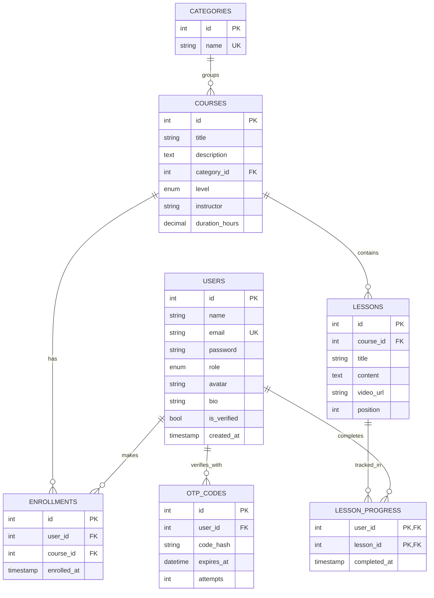

# ER diagram (paste into https://mermaid.live to export PNG for the report)

```mermaid
erDiagram
  USERS ||--o{ ENROLLMENTS : makes
  COURSES ||--o{ ENROLLMENTS : has
  CATEGORIES ||--o{ COURSES : groups
  COURSES ||--o{ LESSONS : contains
  USERS ||--o{ LESSON_PROGRESS : completes
  LESSONS ||--o{ LESSON_PROGRESS : tracked_in
  USERS ||--o{ OTP_CODES : verifies_with

  USERS { int id PK  string name  string email UK  string password  enum role  string avatar  string bio  bool is_verified  timestamp created_at }
  OTP_CODES { int id PK  int user_id FK  string code_hash  datetime expires_at  int attempts }
  CATEGORIES { int id PK  string name UK }
  COURSES { int id PK  string title  text description  int category_id FK  enum level  string instructor  decimal duration_hours }
  LESSONS { int id PK  int course_id FK  string title  text content  string video_url  int position }
  ENROLLMENTS { int id PK  int user_id FK  int course_id FK  timestamp enrolled_at }
  LESSON_PROGRESS { int user_id PK,FK  int lesson_id PK,FK  timestamp completed_at }
```
